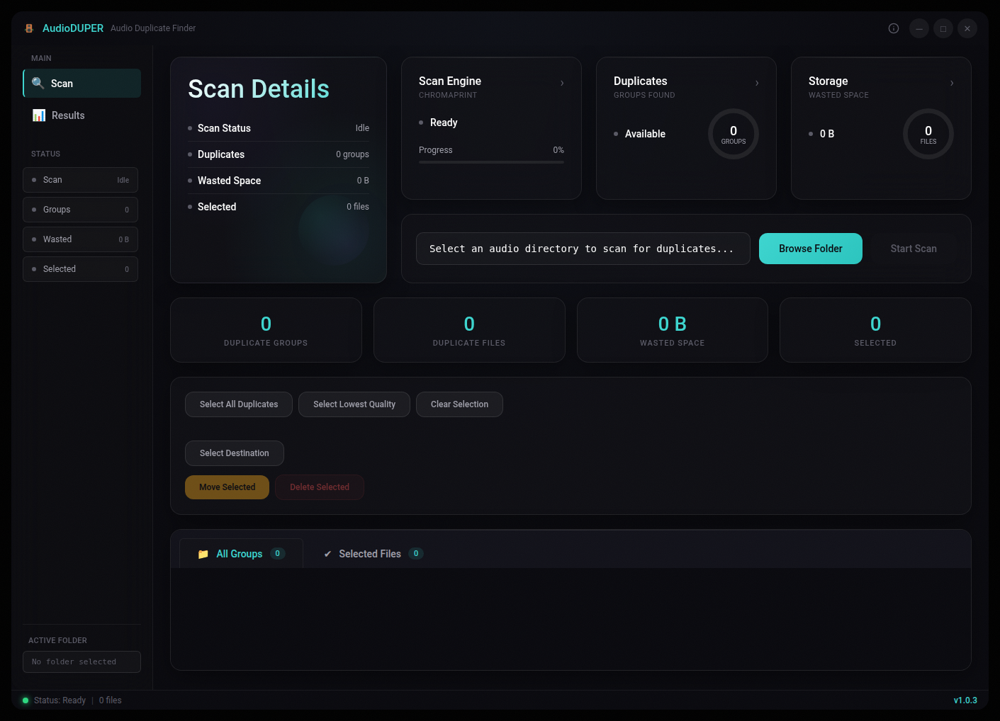

# AudioDUPER 🎵

> Intelligent Audio Duplicate Detection & Cleanup Tool


[](https://opensource.org/licenses/MIT)
[](https://www.electronjs.org/)
[](https://nodejs.org/)
[](https://github.com/sanchez314c/audio-duper/releases)

<p align="center">
  
</p>

AudioDUPER is a desktop application that uses audio fingerprinting to identify and remove duplicate audio files from your music collection. Built with Electron and powered by Chromaprint technology, it provides a dark UI for analyzing audio files with high accuracy.

## ✨ Features

- 🎯 **Smart Detection** - Content-based duplicate detection using Chromaprint fingerprinting
- 🎨 **Modern Dark UI** - Beautiful, responsive interface that's easy on the eyes
- 📊 **Detailed Analysis** - View bitrate, duration, file size, and format information
- ⚡ **Fast Performance** - Multi-threaded processing with real-time progress
- 🛡️ **Safe Operations** - Preview mode and confirmation dialogs prevent accidental deletions
- 📁 **Batch Processing** - Handle large music libraries efficiently
- 🔄 **Smart Sorting** - Keeps highest quality originals automatically
- 🖥️ **Cross-Platform** - Works on macOS, Windows, and Linux
- 🔒 **Privacy First** - All processing happens locally, no data ever leaves your device

## 🚀 Quick Start - One-Command Build & Run

### Option 1: Download Release (Recommended)

1. Visit [Releases](https://github.com/sanchez314c/audio-duper/releases)
2. Download for your platform:
   - **macOS**: `AudioDUPER-x.x.x.dmg` (Intel) or `AudioDUPER-x.x.x-arm64.dmg` (Apple Silicon)
   - **Windows**: `AudioDUPER-Setup-x.x.x.exe`
   - **Linux**: `AudioDUPER-x.x.x.AppImage` or `AudioDUPER-x.x.x.deb`
3. Install and launch

### Option 2: Build from Source

```bash
# Clone and build
git clone https://github.com/sanchez314c/audio-duper.git
cd audio-duper

# Install dependencies and build
npm install
npm run build

# Run the application
npm start              # Production mode
# or
npm run dev            # Development mode with hot reload
```

### Build Options

```bash
# Build for current platform only
npm run dist

# Build for all platforms
npm run dist:all

# Build for specific platform
npm run dist:mac       # macOS (Intel + ARM)
npm run dist:win       # Windows
npm run dist:linux     # Linux
```

## 📋 Prerequisites

For running from source:
- **Node.js** 18+ and npm
- **Git** (for cloning)

The application will handle all other dependencies automatically.

## 📖 Usage

### 1. Starting the Application

- **Pre-built Binary**: Just double-click the application
- **From Source**: Run `npm start`

### 2. Basic Workflow

1. **📁 Select Folder**: Choose your audio directory
2. **🔍 Start Scan**: Begin duplicate detection
3. **📊 Review Results**: Browse duplicate groups with quality comparisons
4. **✅ Select Files**: Choose duplicates using smart selection tools
5. **🗑️ Delete**: Remove selected files safely with confirmation

### 3. Understanding Results

- **Duplicate Groups**: Files with identical audio content are grouped together
- **Quality Ranking**: Files are ranked by bitrate, format, and size
- **Safe Selection**: The app suggests keeping the highest quality version
- **Preview Mode**: Review selections before deletion

## 🎯 Supported Formats

- **MP3** (.mp3) • **FLAC** (.flac) • **WAV** (.wav)
- **M4A/AAC** (.m4a, .aac) • **OGG Vorbis** (.ogg)
- **Opus** (.opus) • **WMA** (.wma)

## 🏆 Quality Algorithm

AudioDUPER automatically ranks files by:

1. **Bitrate** (higher is better)
2. **File size** (larger usually indicates better quality)
3. **Format preference** (lossless > high-quality lossy)
4. **Modification date** (newer versions often improved)

## 📁 Project Structure

```
audio-duper/
├── package.json              # Node.js configuration and dependencies
├── package-lock.json         # Dependency lock file
├── .gitignore               # Git ignore file
├── src/                     # Source code
│   ├── main/               # Electron main process
│   ├── renderer/           # Renderer process (web frontend)
│   ├── preload/            # Preload scripts (secure bridge)
│   └── shared/             # Shared types/utilities
├── build_resources/         # Build resources and assets
│   ├── icons/             # Platform-specific icons
│   ├── screenshots/       # Application screenshots
│   └── entitlements.mac.plist # macOS entitlements
├── scripts/                # Utility scripts
├── docs/                   # Documentation
├── archive/                # Archived/backup files
└── dist/                   # Build outputs (generated)
```

## 🔧 Configuration

### Default Settings

- **Analysis**: Chromaprint audio fingerprinting
- **Threads**: Automatic detection (uses all available cores)
- **Safety**: Confirmation dialogs enabled by default
- **Preview**: Shows file details before deletion

### Customization

The app stores configuration in:
- **macOS**: `~/Library/Application Support/AudioDUPER/`
- **Windows**: `%APPDATA%/AudioDUPER/`
- **Linux**: `~/.config/AudioDUPER/`

## 🐛 Troubleshooting

### Common Issues

<details>
<summary>Application won't start</summary>

1. Ensure you have Node.js 18+ installed
2. Try running `npm install` to refresh dependencies
3. Check that your system supports Electron applications
</details>

<details>
<summary>No duplicates found</summary>

1. Check that the folder contains audio files
2. Ensure files are in supported formats
3. Try with a larger collection (small collections may not have duplicates)
</details>

<details>
<summary>Performance issues</summary>

1. Close other applications while scanning
2. Limit the scan to smaller folders initially
3. Check available disk space for temporary files
</details>

## 🤝 Contributing

Contributions are welcome! Please feel free to submit pull requests or create issues for bug reports and feature requests.

### Development Setup

```bash
# Clone the repo
git clone https://github.com/sanchez314c/audio-duper.git
cd audio-duper

# Install dependencies
npm install

# Run in development mode
npm run dev

# Run tests
npm test

# Lint code
npm run lint
```

## 📄 License

This project is licensed under the MIT License - see the [LICENSE](LICENSE) file for details.

## 🔒 Security & Privacy

- **🔒 No telemetry**: AudioDUPER doesn't collect or transmit any data
- **🏠 Local processing**: All analysis happens on your device
- **🛡️ Secure by design**: Sandboxed renderer with contextual isolation
- **✅ File safety**: Multiple confirmation steps prevent accidental deletion

## 🙏 Acknowledgments

- [Chromaprint](https://acoustid.org/chromaprint) - For the amazing audio fingerprinting technology
- [Electron](https://www.electronjs.org/) - For making cross-platform development possible
- [fpcalc](https://acoustid.org/fpcalc) - The command line tool for audio fingerprint calculation
- The open-source community for inspiration and tools

## 🔗 Links

- [Report Issues](https://github.com/sanchez314c/audio-duper/issues)
- [Request Features](https://github.com/sanchez314c/audio-duper/issues/new?labels=enhancement)
- [Discussions](https://github.com/sanchez314c/audio-duper/discussions)

---

**AudioDUPER v1.0.0** - Intelligent Audio Duplicate Detection

MIT License - Copyright (c) 2026 [J. Michaels](https://github.com/sanchez314c)