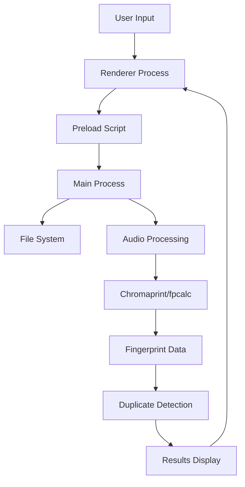

# Development Guide

This comprehensive guide covers all aspects of AudioDUPER development, from setup to deployment. It's designed for developers who want to contribute to or extend the AudioDUPER application.

## 🛠️ Development Environment Setup

### Prerequisites

#### Required Software

- **Node.js** 16+ (LTS version recommended)
- **npm** 8+ or **yarn** 1.22+
- **Git** 2.30+
- **Electron** 28+ (installed via npm)

#### Platform-Specific Requirements

**macOS**

- Xcode Command Line Tools
- macOS 10.15+ (Catalina or later)
- Apple Developer account for distribution

**Windows**

- Visual Studio Build Tools 2019+
- Windows 10/11
- Windows SDK

**Linux**

- Build-essential tools
- libasound2-dev
- libgtk-3-dev
- libgconf-2-4

### Quick Setup

```bash
# Clone repository
git clone https://github.com/your-username/audio-duper.git
cd audio-duper

# Install dependencies
npm install

# Run development mode
npm run dev

# Run tests
npm test

# Build application
npm run build
```

## 🏗️ Project Architecture

### Directory Structure

```
AudioDUPER/
├── src/                    # Source code
│   ├── main.js            # Main Electron process
│   ├── preload.js         # Security bridge
│   ├── index.html         # Main UI
│   └── assets/           # Static resources
├── scripts/               # Build and utility scripts
├── docs/                 # Documentation
├── build-resources/       # Build assets
├── tests/                # Test files
└── dist/                 # Build output
```

### Core Components

#### Main Process (src/main.js)

- Application lifecycle management
- Window creation and management
- File system operations
- Audio processing coordination
- IPC communication handling

#### Renderer Process (src/index.html)

- User interface rendering
- User interaction handling
- Progress display and feedback
- Error presentation

#### Preload Script (src/preload.js)

- Security boundary between main and renderer
- Safe API exposure to renderer
- Input validation and sanitization
- Context bridge implementation

### Data Flow



## 🔧 Development Workflow

### Daily Development

#### Starting Development

```bash
# Start with hot reload
npm run dev

# Start with debugging
npm run dev:debug

# Start with verbose logging
DEBUG=* npm start
```

#### Making Changes

1. **Create Feature Branch**

   ```bash
   git checkout -b feature/your-feature-name
   ```

2. **Make Changes**
   - Edit source files in `src/`
   - Update tests in `tests/`
   - Update documentation if needed

3. **Test Changes**

   ```bash
   npm test
   npm run lint
   npm run build
   ```

4. **Commit Changes**
   ```bash
   git add .
   git commit -m "feat: add your feature description"
   git push origin feature/your-feature-name
   ```

### Code Standards

#### JavaScript Guidelines

- Use modern ES6+ features
- Implement proper error handling
- Use async/await for asynchronous operations
- Follow ESLint configuration
- Add JSDoc comments for functions

#### Example Code Structure

```javascript
/**
 * Processes audio files and generates fingerprints
 * @param {string[]} filePaths - Array of file paths to process
 * @param {Object} options - Processing options
 * @returns {Promise<Object[]>} Array of processed file data
 */
async function processAudioFiles(filePaths, options = {}) {
  const results = [];

  for (const filePath of filePaths) {
    try {
      const metadata = await getAudioMetadata(filePath);
      const fingerprint = await generateFingerprint(filePath);

      results.push({
        path: filePath,
        metadata,
        fingerprint,
        processedAt: new Date().toISOString(),
      });
    } catch (error) {
      console.error(`Failed to process ${filePath}:`, error);
      results.push({
        path: filePath,
        error: error.message,
        processedAt: new Date().toISOString(),
      });
    }
  }

  return results;
}
```

## 🧪 Testing

### Test Structure

#### Unit Tests

```javascript
// tests/unit/audio.test.js
describe('Audio Processing', () => {
  test('should extract metadata from MP3 file', async () => {
    const testFile = 'tests/fixtures/sample.mp3';
    const metadata = await getAudioMetadata(testFile);

    expect(metadata).toHaveProperty('title');
    expect(metadata).toHaveProperty('artist');
    expect(metadata).toHaveProperty('duration');
  });
});
```

#### Integration Tests

```javascript
// tests/integration/file-ops.test.js
describe('File Operations', () => {
  test('should scan directory for audio files', async () => {
    const testDir = 'tests/fixtures/audio-files';
    const files = await scanForAudioFiles(testDir);

    expect(files.length).toBeGreaterThan(0);
    expect(files.every(file => isAudioFile(file))).toBe(true);
  });
});
```

### Running Tests

```bash
# Run all tests
npm test

# Run tests with coverage
npm run test:coverage

# Run specific test file
npm test -- audio.test.js

# Run tests in watch mode
npm run test:watch

# Run tests with verbose output
npm test -- --verbose
```

### Test Coverage

Target coverage levels:

- **Statements**: 90%+
- **Branches**: 85%+
- **Functions**: 90%+
- **Lines**: 90%+

## 🔌 Audio Processing

### Supported Formats

| Format  | Extension  | Priority | Notes              |
| ------- | ---------- | -------- | ------------------ |
| MP3     | .mp3       | High     | Most common format |
| FLAC    | .flac      | High     | Lossless quality   |
| WAV     | .wav       | Medium   | Uncompressed       |
| M4A/AAC | .m4a, .aac | Medium   | Apple format       |
| OGG     | .ogg       | Medium   | Open source        |
| Opus    | .opus      | Low      | Modern format      |
| WMA     | .wma       | Low      | Windows format     |

### Fingerprint Generation

#### Using fpcalc

```javascript
const { exec } = require('child_process');
const util = require('util');
const execPromise = util.promisify(exec);

async function generateFingerprint(filePath) {
  try {
    const { stdout } = await execPromise(`fpcalc -json "${filePath}"`);
    const result = JSON.parse(stdout);
    return result.fingerprint;
  } catch (error) {
    throw new Error(`Failed to generate fingerprint: ${error.message}`);
  }
}
```

#### Quality Assessment

```javascript
function assessQuality(metadata) {
  let score = 0;

  // Bitrate scoring
  if (metadata.bitrate) {
    if (metadata.bitrate >= 320) score += 4;
    else if (metadata.bitrate >= 256) score += 3;
    else if (metadata.bitrate >= 192) score += 2;
    else if (metadata.bitrate >= 128) score += 1;
  }

  // Format preference
  const formatScores = {
    flac: 5,
    wav: 4,
    mp3: 3,
    m4a: 2,
    ogg: 1,
  };
  score += formatScores[metadata.format?.toLowerCase()] || 0;

  return score;
}
```

## 🎨 User Interface Development

### UI Components

#### Main Window Structure

```html
<!DOCTYPE html>
<html>
  <head>
    <meta charset="UTF-8" />
    <title>AudioDUPER</title>
    <link rel="stylesheet" href="styles.css" />
  </head>
  <body>
    <div id="app">
      <header class="toolbar">
        <!-- File selection and controls -->
      </header>

      <main class="content">
        <section id="file-selection">
          <!-- Directory selection interface -->
        </section>

        <section id="progress">
          <!-- Progress indicators -->
        </section>

        <section id="results">
          <!-- Duplicate results display -->
        </section>
      </main>

      <footer class="status-bar">
        <!-- Status information -->
      </footer>
    </div>

    <script src="renderer.js"></script>
  </body>
</html>
```

#### CSS Architecture

```css
/* styles.css - CSS custom properties for theming */
:root {
  --primary-color: #007acc;
  --secondary-color: #28a745;
  --danger-color: #dc3545;
  --background-color: #1e1e1e;
  --text-color: #ffffff;
  --border-color: #444444;
}

/* Dark theme implementation */
body {
  background-color: var(--background-color);
  color: var(--text-color);
  font-family: -apple-system, BlinkMacSystemFont, 'Segoe UI', sans-serif;
}

/* Component styles */
.toolbar {
  display: flex;
  justify-content: space-between;
  align-items: center;
  padding: 8px 16px;
  background-color: var(--background-color);
  border-bottom: 1px solid var(--border-color);
}
```

### IPC Communication

#### Main to Renderer

```javascript
// In main.js
mainWindow.webContents.send('progress-update', {
  current: processedCount,
  total: totalCount,
  message: `Processing ${fileName}...`,
});

// In renderer.js
ipcRenderer.on('progress-update', (event, data) => {
  updateProgressBar(data.current, data.total);
  updateStatusMessage(data.message);
});
```

#### Renderer to Main

```javascript
// In preload.js
contextBridge.exposeInMainWorld('electronAPI', {
  selectDirectory: () => ipcRenderer.invoke('select-directory'),
  scanFiles: dirPath => ipcRenderer.invoke('scan-files', dirPath),
  deleteFiles: filePaths => ipcRenderer.invoke('delete-files', filePaths),
});

// In renderer.js
const files = await window.electronAPI.scanFiles(directoryPath);
```

## 🔒 Security Considerations

### Input Validation

#### File Path Validation

```javascript
function validateFilePath(userPath) {
  // Prevent directory traversal
  if (userPath.includes('..')) {
    throw new Error('Invalid file path');
  }

  // Resolve to absolute path
  const resolvedPath = path.resolve(userPath);

  // Ensure within allowed directories
  if (!resolvedPath.startsWith(allowedBasePath)) {
    throw new Error('Access denied');
  }

  return resolvedPath;
}
```

#### File Type Validation

```javascript
function isAudioFile(filePath) {
  const audioExtensions = [
    '.mp3',
    '.flac',
    '.wav',
    '.m4a',
    '.aac',
    '.ogg',
    '.opus',
    '.wma',
  ];

  const ext = path.extname(filePath).toLowerCase();
  return audioExtensions.includes(ext);
}
```

### Secure IPC

#### Preload Script Security

```javascript
const { contextBridge, ipcRenderer } = require('electron');

contextBridge.exposeInMainWorld('electronAPI', {
  // Only expose safe, validated operations
  selectDirectory: () => ipcRenderer.invoke('select-directory'),

  // Validate inputs before sending
  scanFiles: dirPath => {
    if (typeof dirPath !== 'string' || !dirPath.trim()) {
      throw new Error('Invalid directory path');
    }
    return ipcRenderer.invoke('scan-files', dirPath);
  },
});
```

## 📦 Build System

### Build Configuration

#### package.json Build Scripts

```json
{
  "scripts": {
    "build": "electron-builder",
    "build:mac": "electron-builder --mac",
    "build:win": "electron-builder --win",
    "build:linux": "electron-builder --linux",
    "dist:all": "electron-builder -mwl",
    "dist:current": "electron-builder --publish=never"
  }
}
```

#### Build Configuration

```json
{
  "build": {
    "appId": "com.audiodedupe.app",
    "productName": "AudioDUPER",
    "files": [
      "src/main.js",
      "src/preload.js",
      "src/index.html",
      "package.json"
    ],
    "directories": {
      "output": "dist",
      "buildResources": "build-resources"
    },
    "mac": {
      "category": "public.app-category.utilities",
      "target": [
        {
          "target": "dmg",
          "arch": ["x64", "arm64"]
        }
      ]
    },
    "win": {
      "target": [
        {
          "target": "nsis",
          "arch": ["x64"]
        }
      ]
    },
    "linux": {
      "target": [
        {
          "target": "AppImage",
          "arch": ["x64"]
        }
      ]
    }
  }
}
```

### Build Scripts

#### Enhanced Build Script

```bash
#!/bin/bash
# scripts/build-compile-dist.sh

set -e

echo "🚀 Starting AudioDUPER build process..."

# Clean previous builds
echo "🧹 Cleaning previous builds..."
rm -rf dist/
rm -rf build/

# Install dependencies
echo "📦 Installing dependencies..."
npm ci

# Run tests
echo "🧪 Running tests..."
npm test

# Build application
echo "🔨 Building application..."
npm run build

# Create distributables
echo "📦 Creating distributables..."
npm run dist:current

echo "✅ Build completed successfully!"
```

## 🐛 Debugging

### Main Process Debugging

#### Chrome DevTools

```javascript
// In main.js
mainWindow.webContents.openDevTools();

// Or conditionally
if (process.env.NODE_ENV === 'development') {
  mainWindow.webContents.openDevTools();
}
```

#### VS Code Debugging

```json
// .vscode/launch.json
{
  "version": "0.2.0",
  "configurations": [
    {
      "name": "Debug Main Process",
      "type": "node",
      "request": "launch",
      "program": "${workspaceFolder}/src/main.js",
      "env": {
        "NODE_ENV": "development"
      },
      "console": "integratedTerminal"
    }
  ]
}
```

### Renderer Process Debugging

#### Remote Debugging

```bash
# Start with remote debugging
npm run dev:debug

# Connect Chrome DevTools
# Navigate to chrome://inspect
# Click "inspect" for the target process
```

### Common Issues

#### Memory Leaks

```javascript
// Proper cleanup
function cleanup() {
  if (fileWatcher) {
    fileWatcher.close();
  }
  if (processingTimer) {
    clearInterval(processingTimer);
  }
}

// Handle app exit
app.on('before-quit', cleanup);
```

#### File Handle Leaks

```javascript
// Always close file handles
async function processFile(filePath) {
  let fileHandle;
  try {
    fileHandle = await fs.open(filePath, 'r');
    // Process file
  } finally {
    if (fileHandle) {
      await fileHandle.close();
    }
  }
}
```

## 📊 Performance Optimization

### Memory Management

#### Streaming Large Files

```javascript
const fs = require('fs');
const stream = fs.createReadStream(largeFile);

stream.on('data', chunk => {
  // Process chunk
});

stream.on('end', () => {
  // File processing complete
});
```

#### Worker Threads

```javascript
const { Worker, isMainThread, parentPort } = require('worker_threads');

if (isMainThread) {
  // Main thread
  const worker = new Worker(__filename);
  worker.postMessage({ filePath: 'large-audio.mp3' });
} else {
  // Worker thread
  parentPort.on('message', async ({ filePath }) => {
    const result = await processAudioFile(filePath);
    parentPort.postMessage(result);
  });
}
```

### Processing Optimization

#### Batch Processing

```javascript
async function processBatch(files, batchSize = 10) {
  const results = [];

  for (let i = 0; i < files.length; i += batchSize) {
    const batch = files.slice(i, i + batchSize);
    const batchResults = await Promise.all(
      batch.map(file => processFile(file))
    );
    results.push(...batchResults);

    // Report progress
    reportProgress(i + batchSize, files.length);
  }

  return results;
}
```

#### Caching Results

```javascript
const cache = new Map();

async function getCachedFingerprint(filePath) {
  const stats = await fs.stat(filePath);
  const cacheKey = `${filePath}:${stats.mtime.getTime()}`;

  if (cache.has(cacheKey)) {
    return cache.get(cacheKey);
  }

  const fingerprint = await generateFingerprint(filePath);
  cache.set(cacheKey, fingerprint);

  return fingerprint;
}
```

## 🚀 Deployment

### Pre-Deployment Checklist

- [ ] All tests passing
- [ ] Code coverage targets met
- [ ] Security scan clean
- [ ] Documentation updated
- [ ] Version number updated
- [ ] CHANGELOG.md updated
- [ ] Build tested on all platforms

### Release Process

```bash
# 1. Update version
npm version patch  # or minor/major

# 2. Update changelog
# Edit CHANGELOG.md

# 3. Create release
npm run dist:all

# 4. Upload to GitHub Releases
gh release create v1.2.3 dist/* --title "Release v1.2.3"

# 5. Deploy to package managers (if applicable)
npm publish
```

### Automated Deployment

#### GitHub Actions

```yaml
# .github/workflows/release.yml
name: Release

on:
  push:
    tags:
      - 'v*'

jobs:
  release:
    runs-on: ${{ matrix.os }}
    strategy:
      matrix:
        os: [macos-latest, windows-latest, ubuntu-latest]

    steps:
      - uses: actions/checkout@v3
      - uses: actions/setup-node@v3
        with:
          node-version: '18'

      - run: npm ci
      - run: npm test
      - run: npm run build

      - name: Upload artifacts
        uses: actions/upload-artifact@v3
        with:
          name: dist-${{ matrix.os }}
          path: dist/
```

## 📚 Resources

### Documentation

- [Electron Documentation](https://www.electronjs.org/docs)
- [Node.js Documentation](https://nodejs.org/docs/)
- [Chromaprint Documentation](https://acoustid.org/chromaprint)
- [fpcalc Manual](https://acoustid.org/fpcalc)

### Tools and Libraries

- **Electron Builder**: Application packaging
- **Jest**: Testing framework
- **ESLint**: Code linting
- **Prettier**: Code formatting
- **music-metadata**: Audio metadata extraction

### Community

- [Electron Community](https://www.electronjs.org/community)
- [GitHub Discussions](https://github.com/electron/electron/discussions)
- [Stack Overflow](https://stackoverflow.com/questions/tagged/electron)

---

This development guide provides comprehensive information for AudioDUPER development. For specific questions or issues, refer to the project documentation or create an issue on GitHub.
