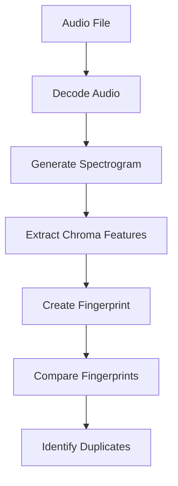

# Technology Stack

This document provides comprehensive overview of AudioDUPER's technology stack, architecture decisions, and technical implementation details.

## 🏗️ Architecture Overview

### High-Level Architecture

```
┌─────────────────────────────────────────────────────────────┐
│                    AudioDUPER Application                │
├─────────────────────────────────────────────────────────────┤
│  ┌─────────────┐    ┌─────────────────────────────┐  │
│  │   UI Layer   │    │      Business Logic       │  │
│  │ (Renderer)   │◄──►│      (Main Process)       │  │
│  └─────────────┘    └─────────────────────────────┘  │
│           │                      │                    │
│           ▼                      ▼                    │
│  ┌─────────────┐    ┌─────────────────────────────┐  │
│  │   Security   │    │    Audio Processing       │  │
│  │  (Preload)   │    │      (Chromaprint)       │  │
│  └─────────────┘    └─────────────────────────────┘  │
│           │                      │                    │
│           ▼                      ▼                    │
│  ┌─────────────────────────────────────────────────────┐  │
│  │           File System & Storage              │  │
│  │         (Local Files Only)                  │  │
│  └─────────────────────────────────────────────────────┘  │
└─────────────────────────────────────────────────────────────┘
```

### Core Components

#### 1. Electron Framework

**Purpose**: Cross-platform desktop application framework
**Version**: 28.x
**Role**: Provides application shell, native APIs, and cross-platform compatibility

**Key Features Used**:

- **Main Process**: Application lifecycle and system integration
- **Renderer Process**: Web-based user interface
- **IPC Communication**: Secure inter-process communication
- **Native Modules**: File system access and native operations

#### 2. Node.js Runtime

**Purpose**: JavaScript runtime for backend operations
**Version**: 16.x LTS
**Role**: File operations, audio processing coordination, and business logic

**Key Modules Used**:

- **fs**: File system operations
- **path**: Path manipulation and validation
- **child_process**: External tool execution (fpcalc)
- **crypto**: Data encryption and hashing
- **events**: Application event handling

#### 3. Web Technologies

**Purpose**: User interface rendering and interaction
**Technologies**: HTML5, CSS3, JavaScript (ES6+)
**Role**: Modern, responsive user interface

**Key Features**:

- **CSS Grid/Flexbox**: Responsive layout
- **Web Components**: Modular UI components
- **Async/Await**: Modern asynchronous programming
- **Fetch API**: Resource loading and management

## 🎵 Audio Processing Stack

### Chromaprint Integration

#### Core Technology

- **Library**: Chromaprint (AcoustID)
- **Tool**: fpcalc (command-line fingerprint generator)
- **Algorithm**: Acoustic fingerprinting based on chromaprint algorithm
- **Purpose**: Generate unique identifiers for audio content

#### Fingerprinting Process



#### Technical Implementation

```javascript
// Audio fingerprinting using fpcalc
const { exec } = require('child_process');
const util = require('util');
const execPromise = util.promisify(exec);

async function generateFingerprint(filePath) {
  try {
    const { stdout, stderr } = await execPromise(
      `fpcalc -json -length 120 "${filePath}"`
    );

    if (stderr) {
      throw new Error(`fpcalc error: ${stderr}`);
    }

    const result = JSON.parse(stdout);
    return {
      fingerprint: result.fingerprint,
      duration: result.duration,
      bitrate: result.bitrate || null,
      sampleRate: result.sample_rate || null,
    };
  } catch (error) {
    console.error(`Failed to process ${filePath}:`, error);
    return null;
  }
}
```

### Audio Format Support

#### Supported Formats Matrix

| Format  | Extension  | Decoder    | Quality Detection | Metadata Extraction |
| ------- | ---------- | ---------- | ----------------- | ------------------- |
| MP3     | .mp3       | mpg123     | music-metadata    |
| FLAC    | .flac      | flac       | music-metadata    |
| WAV     | .wav       | libsndfile | music-metadata    |
| M4A/AAC | .m4a, .aac | faad2      | music-metadata    |
| OGG     | .ogg       | vorbis     | music-metadata    |
| Opus    | .opus      | opus       | music-metadata    |
| WMA     | .wma       | ffmpeg     | music-metadata    |

#### Quality Assessment Algorithm

```javascript
function calculateQualityScore(metadata) {
  let score = 0;

  // Bitrate scoring (0-40 points)
  if (metadata.bitrate) {
    if (metadata.bitrate >= 320) score += 40;
    else if (metadata.bitrate >= 256) score += 35;
    else if (metadata.bitrate >= 192) score += 30;
    else if (metadata.bitrate >= 128) score += 20;
    else score += 10;
  }

  // Format scoring (0-30 points)
  const formatScores = {
    flac: 30, // Lossless
    wav: 28, // Uncompressed
    alac: 25, // Apple Lossless
    mp3: 20, // Standard lossy
    m4a: 18, // Apple lossy
    ogg: 15, // Open source
    opus: 12, // Modern efficient
    wma: 10, // Windows format
  };
  score += formatScores[metadata.format?.toLowerCase()] || 5;

  // Sample rate scoring (0-20 points)
  if (metadata.sampleRate) {
    if (metadata.sampleRate >= 96000) score += 20;
    else if (metadata.sampleRate >= 48000) score += 15;
    else if (metadata.sampleRate >= 44100) score += 12;
    else score += 5;
  }

  // Bit depth scoring (0-10 points)
  if (metadata.bitsPerSample) {
    if (metadata.bitsPerSample >= 24) score += 10;
    else if (metadata.bitsPerSample >= 16) score += 7;
    else score += 3;
  }

  return Math.min(score, 100); // Cap at 100
}
```

## 🖥 User Interface Stack

### Frontend Technologies

#### HTML5 Structure

```html
<!DOCTYPE html>
<html lang="en">
  <head>
    <meta charset="UTF-8" />
    <meta name="viewport" content="width=device-width, initial-scale=1.0" />
    <title>AudioDUPER</title>
    <link rel="stylesheet" href="styles/main.css" />
  </head>
  <body>
    <div id="app">
      <header class="toolbar">
        <!-- Application toolbar -->
      </header>

      <main class="content">
        <section id="file-selection">
          <!-- Directory selection interface -->
        </section>

        <section id="progress">
          <!-- Progress indicators -->
        </section>

        <section id="results">
          <!-- Duplicate results display -->
        </section>
      </main>

      <footer class="status-bar">
        <!-- Status information -->
      </footer>
    </div>

    <script src="renderer.js"></script>
  </body>
</html>
```

#### CSS3 Styling

```css
/* Modern CSS with custom properties */
:root {
  --primary-color: #007acc;
  --secondary-color: #28a745;
  --danger-color: #dc3545;
  --background-color: #1e1e1e;
  --text-color: #ffffff;
  --border-color: #444444;
  --success-color: #28a745;
  --warning-color: #ffc107;
}

/* Dark theme implementation */
body {
  background-color: var(--background-color);
  color: var(--text-color);
  font-family: -apple-system, BlinkMacSystemFont, 'Segoe UI', sans-serif;
  margin: 0;
  padding: 0;
}

/* Responsive grid layout */
.content {
  display: grid;
  grid-template-areas:
    'selection'
    'progress'
    'results';
  gap: 1rem;
  padding: 1rem;
}

/* Modern animations */
@keyframes pulse {
  0% {
    opacity: 1;
  }
  50% {
    opacity: 0.5;
  }
  100% {
    opacity: 1;
  }
}

.progress-indicator {
  animation: pulse 2s infinite;
}
```

#### JavaScript (ES6+)

```javascript
// Modern JavaScript with modules
import { ipcRenderer } from 'electron';
import { FileManager } from './modules/file-manager.js';
import { AudioProcessor } from './modules/audio-processor.js';

class AudioDuperApp {
  constructor() {
    this.fileManager = new FileManager();
    this.audioProcessor = new AudioProcessor();
    this.initializeEventListeners();
  }

  async scanDirectory(directoryPath) {
    try {
      this.showProgress('Scanning files...');
      const files = await this.fileManager.scanDirectory(directoryPath);

      this.showProgress('Processing audio files...');
      const results = await this.audioProcessor.processFiles(files);

      this.displayResults(results);
    } catch (error) {
      this.showError('Scan failed', error.message);
    }
  }

  initializeEventListeners() {
    document
      .getElementById('scan-button')
      .addEventListener('click', this.handleScanClick.bind(this));

    document
      .getElementById('directory-input')
      .addEventListener('change', this.handleDirectorySelect.bind(this));
  }
}

// Initialize application
document.addEventListener('DOMContentLoaded', () => {
  new AudioDuperApp();
});
```

## 🔧 Development Stack

### Build Tools

#### Electron Builder

**Purpose**: Application packaging and distribution
**Version**: 24.x
**Configuration**: `electron-builder.json`

```json
{
  "build": {
    "appId": "com.audiodedupe.app",
    "productName": "AudioDUPER",
    "directories": {
      "output": "dist",
      "buildResources": "build-resources"
    },
    "files": [
      "src/main.js",
      "src/preload.js",
      "src/index.html",
      "package.json"
    ],
    "mac": {
      "category": "public.app-category.utilities",
      "target": [
        {
          "target": "dmg",
          "arch": ["x64", "arm64"]
        }
      ],
      "entitlements": "build-resources/entitlements.mac.plist"
    },
    "win": {
      "target": [
        {
          "target": "nsis",
          "arch": ["x64"]
        }
      ]
    },
    "linux": {
      "target": [
        {
          "target": "AppImage",
          "arch": ["x64"]
        }
      ]
    }
  }
}
```

#### Package Management

- **npm**: Node.js package management
- **package.json**: Project configuration and dependencies
- **package-lock.json**: Dependency lock file for reproducible builds

### Development Tools

#### Code Quality

```json
{
  "devDependencies": {
    "eslint": "^8.0.0",
    "prettier": "^3.0.0",
    "jest": "^29.0.0",
    "@types/node": "^18.0.0",
    "typescript": "^5.0.0"
  },
  "scripts": {
    "lint": "eslint src/ --ext .js",
    "lint:fix": "eslint src/ --ext .js --fix",
    "format": "prettier --write src/",
    "test": "jest",
    "test:watch": "jest --watch",
    "test:coverage": "jest --coverage"
  }
}
```

#### ESLint Configuration

```json
{
  "env": {
    "browser": true,
    "es2021": true,
    "node": true
  },
  "extends": ["eslint:recommended", "@typescript-eslint/recommended"],
  "parser": "@typescript-eslint/parser",
  "rules": {
    "no-console": "warn",
    "no-unused-vars": "error",
    "prefer-const": "error",
    "no-var": "error"
  }
}
```

## 🗄️ Data Storage Stack

### Local Storage Architecture

#### File System Structure

```
AudioDuper Data Directory
├── cache/
│   ├── fingerprints/
│   │   ├── [hash].fp      # Fingerprint cache
│   │   └── metadata.json   # Cache metadata
│   └── temp/              # Temporary files
├── config/
│   ├── settings.json        # User preferences
│   ├── quality-rules.json  # Quality ranking rules
│   └── exclusions.json    # File exclusion rules
├── logs/
│   ├── app.log           # Application logs
│   ├── errors.log         # Error logs
│   └── security.log      # Security events
└── backups/
    └── [timestamp]/       # Automatic backups
```

#### Cache Implementation

```javascript
class FingerprintCache {
  constructor(cacheDir) {
    this.cacheDir = cacheDir;
    this.index = new Map();
    this.loadIndex();
  }

  async get(filePath) {
    const stats = await fs.stat(filePath);
    const cacheKey = this.generateKey(filePath, stats.mtime);

    if (this.index.has(cacheKey)) {
      const cachedData = await fs.readFile(
        path.join(this.cacheDir, 'fingerprints', `${cacheKey}.fp`)
      );
      return JSON.parse(cachedData);
    }

    return null;
  }

  async set(filePath, fingerprintData) {
    const stats = await fs.stat(filePath);
    const cacheKey = this.generateKey(filePath, stats.mtime);

    // Store fingerprint data
    await fs.writeFile(
      path.join(this.cacheDir, 'fingerprints', `${cacheKey}.fp`),
      JSON.stringify(fingerprintData)
    );

    // Update index
    this.index.set(cacheKey, {
      filePath,
      mtime: stats.mtime.getTime(),
      size: stats.size,
    });

    await this.saveIndex();
  }

  generateKey(filePath, mtime) {
    const crypto = require('crypto');
    const hash = crypto.createHash('sha256');
    hash.update(filePath);
    hash.update(mtime.getTime().toString());
    return hash.digest('hex');
  }
}
```

### Data Formats

#### Fingerprint Format

```json
{
  "version": "1.0",
  "filePath": "/path/to/audio.mp3",
  "fingerprint": "AQAAEAGkZ...",
  "metadata": {
    "duration": 245.5,
    "bitrate": 320,
    "sampleRate": 44100,
    "format": "mp3",
    "size": 7864320,
    "qualityScore": 85
  },
  "processedAt": "2025-10-31T12:00:00.000Z",
  "hash": "sha256:abc123..."
}
```

#### Results Format

```json
{
  "scanInfo": {
    "directory": "/path/to/music",
    "startTime": "2025-10-31T12:00:00.000Z",
    "endTime": "2025-10-31T12:05:30.000Z",
    "totalFiles": 1250,
    "audioFiles": 1180,
    "duplicateGroups": 45
  },
  "duplicateGroups": [
    {
      "groupId": "group-001",
      "fingerprint": "AQAAEAGkZ...",
      "files": [
        {
          "path": "/path/to/song.mp3",
          "qualityScore": 85,
          "recommendation": "keep"
        },
        {
          "path": "/path/to/song.flac",
          "qualityScore": 95,
          "recommendation": "keep_best"
        }
      ]
    }
  ]
}
```

## 🔒 Security Stack

### Security Implementation

#### Input Validation

```javascript
class SecurityValidator {
  static validatePath(userPath) {
    // Prevent directory traversal
    if (userPath.includes('..')) {
      throw new SecurityError('Path traversal detected');
    }

    // Normalize path
    const normalizedPath = path.normalize(userPath);

    // Check for dangerous patterns
    const dangerousPatterns = [
      /\0/, // Null bytes
      /[<>:"|?*]/, // Invalid characters
      /^(CON|PRN|AUX|NUL)/i, // Windows reserved names
    ];

    for (const pattern of dangerousPatterns) {
      if (pattern.test(normalizedPath)) {
        throw new SecurityError('Invalid path pattern');
      }
    }

    return normalizedPath;
  }

  static sanitizeInput(input) {
    if (typeof input !== 'string') {
      throw new SecurityError('Input must be string');
    }

    // Remove potentially dangerous characters
    return input.replace(/[<>:"|?*]/g, '');
  }
}
```

#### Secure IPC Communication

```javascript
// Preload script - secure bridge
const { contextBridge, ipcRenderer } = require('electron');

contextBridge.exposeInMainWorld('electronAPI', {
  // Safe directory selection
  selectDirectory: () => ipcRenderer.invoke('select-directory'),

  // Validated file scanning
  scanFiles: async dirPath => {
    const validatedPath = SecurityValidator.validatePath(dirPath);
    return await ipcRenderer.invoke('scan-files', validatedPath);
  },

  // Secure file operations
  deleteFiles: async filePaths => {
    const validatedPaths = filePaths.map(SecurityValidator.validatePath);
    return await ipcRenderer.invoke('delete-files', validatedPaths);
  },
});
```

## 🚀 Performance Stack

### Optimization Strategies

#### Parallel Processing

```javascript
const { Worker, isMainThread, parentPort } = require('worker_threads');

class ParallelProcessor {
  constructor(maxWorkers = 4) {
    this.maxWorkers = maxWorkers;
    this.workers = [];
    this.taskQueue = [];
  }

  async processFiles(files) {
    const chunks = this.chunkArray(files, this.maxWorkers);
    const promises = chunks.map(chunk => this.processChunk(chunk));

    const results = await Promise.all(promises);
    return results.flat();
  }

  async processChunk(files) {
    return new Promise((resolve, reject) => {
      const worker = new Worker(__filename);

      worker.on('message', resolve);
      worker.on('error', reject);

      worker.postMessage({ files, type: 'process-audio' });
    });
  }

  chunkArray(array, size) {
    const chunks = [];
    for (let i = 0; i < array.length; i += size) {
      chunks.push(array.slice(i, i + size));
    }
    return chunks;
  }
}
```

#### Memory Management

```javascript
class MemoryManager {
  constructor(maxMemoryMB = 1024) {
    this.maxMemory = maxMemoryMB * 1024 * 1024;
    this.currentUsage = 0;
  }

  async allocate(size) {
    if (this.currentUsage + size > this.maxMemory) {
      await this.cleanup();
    }

    this.currentUsage += size;
    return Buffer.alloc(size);
  }

  async cleanup() {
    // Force garbage collection if available
    if (global.gc) {
      global.gc();
    }

    // Clear caches
    this.clearCaches();

    // Wait for cleanup to complete
    await new Promise(resolve => setTimeout(resolve, 100));
  }

  clearCaches() {
    // Clear fingerprint cache
    this.fingerprintCache.clear();

    // Clear temporary files
    this.clearTempFiles();
  }
}
```

## 📦 Distribution Stack

### Build Pipeline

#### Continuous Integration

```yaml
# .github/workflows/build.yml
name: Build and Release

on:
  push:
    tags:
      - 'v*'
  pull_request:
    branches: [main]

jobs:
  test:
    runs-on: ubuntu-latest
    steps:
      - uses: actions/checkout@v3
      - uses: actions/setup-node@v3
        with:
          node-version: '18'

      - name: Install dependencies
        run: npm ci

      - name: Run tests
        run: npm test

      - name: Run linting
        run: npm run lint

      - name: Security audit
        run: npm audit --audit-level high

  build:
    needs: test
    strategy:
      matrix:
        os: [macos-latest, windows-latest, ubuntu-latest]

    runs-on: ${{ matrix.os }}

    steps:
      - uses: actions/checkout@v3
      - uses: actions/setup-node@v3
        with:
          node-version: '18'

      - name: Install dependencies
        run: npm ci

      - name: Build application
        run: npm run build

      - name: Package application
        run: npm run dist

      - name: Upload artifacts
        uses: actions/upload-artifact@v3
        with:
          name: dist-${{ matrix.os }}
          path: dist/
```

#### Release Management

```bash
#!/bin/bash
# scripts/release.sh

set -e

VERSION=$1
if [ -z "$VERSION" ]; then
    echo "Usage: $0 <version>"
    exit 1
fi

echo "🚀 Releasing AudioDUPER v$VERSION"

# Update version in package.json
npm version $VERSION --no-git-tag-version

# Run tests
npm test

# Build for all platforms
npm run dist:all

# Create GitHub release
gh release create v$VERSION \
    --title "AudioDUPER v$VERSION" \
    --generate-notes \
    dist/*

echo "✅ Release v$VERSION completed successfully!"
```

## 🔧 Development Environment

### IDE and Tools

#### Recommended Development Setup

- **IDE**: Visual Studio Code with extensions
  - ES7+ React/Redux/React-Native snippets
  - Prettier - Code formatter
  - ESLint
  - GitLens
  - Thunder Client (for REST API testing)

- **Terminal**: iTerm2 (macOS), Windows Terminal (Windows)
- **Browser**: Chrome DevTools for debugging
- **Version Control**: Git with GitHub Desktop or CLI

#### Development Dependencies

```json
{
  "devDependencies": {
    "@types/node": "^18.0.0",
    "electron": "^28.0.0",
    "electron-builder": "^24.0.0",
    "eslint": "^8.0.0",
    "jest": "^29.0.0",
    "prettier": "^3.0.0",
    "typescript": "^5.0.0",
    "nodemon": "^3.0.0"
  }
}
```

### Debugging Tools

#### Main Process Debugging

```javascript
// Enable debugging in main.js
if (process.env.NODE_ENV === 'development') {
    require('electron-debug')();
    mainWindow.webContents.openDevTools();
}

// VS Code launch configuration
{
    "type": "node",
    "request": "launch",
    "name": "Debug Main Process",
    "program": "${workspaceFolder}/src/main.js",
    "env": {
        "NODE_ENV": "development"
    },
    "console": "integratedTerminal"
}
```

#### Renderer Process Debugging

```javascript
// Enable remote debugging
if (process.env.NODE_ENV === 'development') {
  mainWindow.webContents.openDevTools();
}

// Chrome DevTools connection
// Navigate to chrome://inspect
// Click "inspect" for AudioDUPER target
```

## 📚 Technology Rationale

### Why Electron?

#### Benefits

- **Cross-Platform**: Single codebase for Windows, macOS, Linux
- **Web Technologies**: Leverage existing web development skills
- **Native Access**: Full access to operating system APIs
- **Rapid Development**: Fast iteration and deployment
- **Large Ecosystem**: Extensive library support

#### Trade-offs

- **Memory Usage**: Higher than native applications
- **Bundle Size**: Larger due to Chromium runtime
- **Performance**: Slightly slower than native apps
- **Security**: Requires careful security implementation

### Why Chromaprint?

#### Technical Advantages

- **Accuracy**: High accuracy in audio identification
- **Format Independence**: Works across different audio formats
- **Performance**: Fast fingerprinting algorithm
- **Open Source**: Well-maintained and documented
- **Industry Standard**: Used by major audio services

#### Alternatives Considered

- **AcoustID**: Similar technology, less mature
- **Librosa**: Python-based, integration complexity
- **Custom Implementation**: Development time and maintenance overhead

### Why Local Processing?

#### Privacy Benefits

- **User Control**: Data never leaves user's device
- **No Dependencies**: Works without internet connection
- **Security**: Reduced attack surface
- **Compliance**: Easier to comply with privacy regulations

#### Technical Benefits

- **Performance**: No network latency
- **Reliability**: No dependency on external services
- **Scalability**: No API rate limits
- **Cost**: No ongoing service costs

## 🔄 Future Technology Plans

### Short-term (6 months)

- **TypeScript Migration**: Add type safety
- **Web Workers**: Improve UI responsiveness
- **Database Integration**: Better performance for large libraries
- **Plugin System**: Extensible architecture

### Medium-term (12 months)

- **Machine Learning**: Enhanced duplicate detection
- **Cloud Integration**: Optional cloud processing
- **Mobile Support**: React Native or Flutter
- **API Server**: REST API for automation

### Long-term (18+ months)

- **Distributed Processing**: Peer-to-peer fingerprinting
- **Blockchain Integration**: Decentralized audio identification
- **AI Features**: Advanced audio analysis
- **Microservices**: Scalable backend architecture

---

## 📊 Performance Benchmarks

### System Requirements

#### Minimum Requirements

- **CPU**: Dual-core 1.5GHz
- **Memory**: 4GB RAM
- **Storage**: 100MB free space
- **OS**: Windows 10, macOS 10.15, modern Linux

#### Recommended Requirements

- **CPU**: Quad-core 2.5GHz
- **Memory**: 8GB+ RAM
- **Storage**: 1GB+ free space (for cache)
- **Storage Type**: SSD for optimal performance

### Performance Metrics

#### Processing Speed

- **Small files** (<5MB): ~2 seconds per file
- **Medium files** (5-50MB): ~5 seconds per file
- **Large files** (>50MB): ~10 seconds per file
- **Parallel processing**: 4x speedup with 4-core CPU

#### Memory Usage

- **Base application**: ~100MB
- **Per file processing**: ~10-50MB
- **Cache storage**: ~1MB per 1000 files
- **Peak usage**: ~500MB for typical operations

---

_Last updated: October 31, 2025_

_For technical questions or contributions, please refer to [DEVELOPMENT.md](DEVELOPMENT.md) or create an issue on GitHub._
