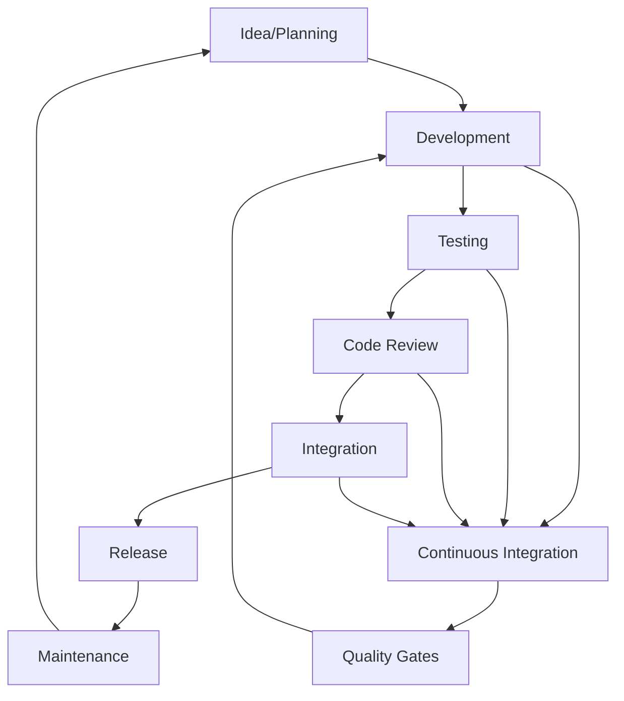

# Development Workflow

This document defines the complete development workflow for AudioDUPER, from initial setup through deployment and maintenance. It ensures consistency, quality, and efficiency across all development activities.

## 🔄 Development Lifecycle

### Overview



### Phase Descriptions

#### 1. Planning & Design

- **Feature definition** and requirements analysis
- **Technical design** and architecture decisions
- **Task breakdown** and estimation
- **Resource allocation** and timeline planning

#### 2. Development

- **Feature implementation** following coding standards
- **Unit testing** during development
- **Documentation updates** as features are built
- **Regular commits** with descriptive messages

#### 3. Testing & Quality Assurance

- **Comprehensive testing** across platforms
- **Performance testing** and optimization
- **Security testing** and vulnerability scanning
- **User acceptance testing** and feedback collection

#### 4. Integration & Deployment

- **Cross-platform integration** and compatibility testing
- **Build automation** and package creation
- **Release preparation** and documentation
- **Distribution** and deployment automation

#### 5. Maintenance & Monitoring

- **Issue monitoring** and bug triage
- **Performance monitoring** and optimization
- **User feedback** collection and analysis
- **Regular updates** and security patches

## 🛠️ Development Environment Setup

### Prerequisites

#### System Requirements

- **Operating System**: macOS 10.15+, Windows 10+, Linux (Ubuntu 18.04+)
- **Node.js**: 16.x LTS or newer
- **Git**: 2.30+ for version control
- **IDE**: VS Code (recommended) with extensions

#### Required Software

```bash
# Core development tools
node --version    # Should be 16.x LTS
npm --version     # Should be 8.x+
git --version     # Should be 2.30+

# Platform-specific tools
# macOS
xcode-select --install

# Windows
# Visual Studio Build Tools 2019+

# Linux
sudo apt-get install build-essential
```

### Development Tools Configuration

#### VS Code Setup

```json
// .vscode/settings.json
{
  "editor.formatOnSave": true,
  "editor.codeActionsOnSave": {
    "source.fixAll.eslint": true
  },
  "files.exclude": {
    "**/node_modules": true,
    "**/dist": true,
    "**/.git": true
  },
  "typescript.preferences.importModuleSpecifier": "relative"
}
```

#### VS Code Extensions

```json
// .vscode/extensions.json
{
  "recommendations": [
    "esbenp.prettier-vscode",
    "dbaeumer.vscode-eslint",
    "ms-vscode.vscode-typescript-next",
    "bradlc.vscode-tailwindcss",
    "ms-vscode.vscode-json"
  ]
}
```

### Repository Setup

#### Initial Clone

```bash
# Clone repository
git clone https://github.com/your-username/audio-duper.git
cd audio-duper

# Install dependencies
npm install

# Set up development environment
npm run dev:setup
```

#### Git Configuration

```bash
# Configure git user
git config --global user.name "Your Name"
git config --global user.email "your.email@example.com"

# Configure git settings
git config --global init.defaultBranch main
git config --global pull.rebase false
git config --global core.autocrlf input
```

#### Branch Strategy

```bash
# Main branches
main          # Production-ready code
develop        # Integration branch for features
release/v*     # Release preparation branches
hotfix/*       # Critical fixes for production

# Feature branches
feature/feature-name
bugfix/bug-description
docs/documentation-update
```

## 📝 Coding Standards

### Code Style

#### JavaScript Standards

```javascript
// Use modern ES6+ features
const { readFile, writeFile } = require('fs').promises;

// Prefer async/await over callbacks
async function processFile(filePath) {
  try {
    const content = await readFile(filePath, 'utf8');
    return await processContent(content);
  } catch (error) {
    console.error(`Failed to process ${filePath}:`, error);
    throw error;
  }
}

// Use destructuring and template literals
function formatResult({ success, data, message }) {
  return `Status: ${success ? '✅' : '❌'}, Message: ${message}`;
}

// Prefer const/let over var
const API_BASE_URL = 'https://api.audioduper.com';
let currentProgress = 0;
```

#### ESLint Configuration

```json
// .eslintrc.json
{
  "env": {
    "browser": true,
    "es2021": true,
    "node": true
  },
  "extends": ["eslint:recommended", "@typescript-eslint/recommended"],
  "parser": "@typescript-eslint/parser",
  "rules": {
    "no-console": "warn",
    "no-unused-vars": "error",
    "prefer-const": "error",
    "no-var": "error",
    "object-shorthand": "error",
    "prefer-template-literals": "error"
  },
  "overrides": [
    {
      "files": ["*.test.js", "*.spec.js"],
      "env": {
        "jest": true
      }
    }
  ]
}
```

#### Prettier Configuration

```json
// .prettierrc.json
{
  "semi": true,
  "trailingComma": "es5",
  "singleQuote": true,
  "printWidth": 100,
  "tabWidth": 4,
  "useTabs": false,
  "bracketSpacing": true,
  "arrowParens": "avoid"
}
```

### File Organization

#### Directory Structure

```
src/
├── main/                    # Main process code
│   ├── main.js            # Application entry point
│   ├── menu.js             # Application menu
│   ├── windows/            # Window management
│   └── services/           # Backend services
├── renderer/                  # Renderer process code
│   ├── index.html          # Main UI
│   ├── styles/            # CSS and styling
│   ├── scripts/           # Frontend JavaScript
│   └── components/        # UI components
├── preload/                   # Preload scripts
│   └── preload.js         # Security bridge
├── shared/                    # Shared utilities
│   ├── constants.js       # Application constants
│   ├── utils.js           # Utility functions
│   └── types.js           # Type definitions
└── assets/                     # Static assets
    ├── icons/             # Application icons
    ├── images/            # UI images
    └── fonts/             # Custom fonts
```

#### Naming Conventions

```javascript
// Files: kebab-case
file-manager.js
audio-processor.js
duplicate-detector.js

// Directories: kebab-case
audio-processing/
user-interface/
file-operations/

// Variables: camelCase
const audioFiles = [];
const currentDirectory = '';
const isProcessingComplete = false;

// Functions: camelCase
function processAudioFiles() {}
function generateFingerprint() {}
function updateProgressBar() {}

// Constants: UPPER_SNAKE_CASE
const MAX_FILE_SIZE = 100 * 1024 * 1024; // 100MB
const SUPPORTED_FORMATS = ['mp3', 'flac', 'wav'];
const DEFAULT_TIMEOUT = 30000; // 30 seconds

// Classes: PascalCase
class AudioProcessor {}
class FileManager {}
class DuplicateDetector {}

// Components: PascalCase
const FileSelector = () => {};
const ProgressBar = () => {};
const ResultsTable = () => {};
```

## 🧪 Testing Strategy

### Test Types

#### Unit Tests

```javascript
// tests/unit/audio-processor.test.js
describe('AudioProcessor', () => {
    describe('generateFingerprint', () => {
        test('should generate fingerprint for valid MP3 file', async () => {
            const testFile = 'tests/fixtures/sample.mp3';
            const result = await AudioProcessor.generateFingerprint(testFile);

            expect(result).toHaveProperty('fingerprint');
            expect(result).toHaveProperty('duration');
            expect(result.fingerprint).toMatch(/^[A-Za-z0-9+$/);
        });

        test('should handle invalid file gracefully', async () => {
            const invalidFile = 'nonexistent.mp3';
            const result = await AudioProcessor.generateFingerprint(invalidFile);

            expect(result).toBeNull();
        });
    });
});
```

#### Integration Tests

```javascript
// tests/integration/file-operations.test.js
describe('File Operations Integration', () => {
  test('should scan directory and process files', async () => {
    const testDir = 'tests/fixtures/test-library';
    const files = await FileManager.scanDirectory(testDir);

    expect(files.length).toBeGreaterThan(0);
    expect(files.every(file => isAudioFile(file))).toBe(true);

    const results = await AudioProcessor.processFiles(files);
    expect(results).toHaveProperty('duplicateGroups');
    expect(results.duplicateGroups.length).toBeGreaterThan(0);
  });
});
```

#### End-to-End Tests

```javascript
// tests/e2e/user-workflow.test.js
describe('User Workflow E2E', () => {
  test('should complete full duplicate detection workflow', async () => {
    // Launch application
    const app = await Application.launch();

    // Select directory
    await app.client.selectDirectory('tests/fixtures/music-library');

    // Start scan
    await app.client.click('#scan-button');

    // Wait for completion
    await app.client.waitForElement('#results-container');

    // Verify results
    const results = await app.client.getResults();
    expect(results.duplicateGroups.length).toBeGreaterThan(0);

    // Clean up
    await app.stop();
  });
});
```

### Test Configuration

#### Jest Configuration

```json
// jest.config.js
module.exports = {
    testEnvironment: 'node',
    roots: ['<rootDir>/tests'],
    testMatch: [
        '**/__tests__/**/*.js',
        '**/?(*.)+(spec|test).js'
    ],
    collectCoverageFrom: [
        'src/**/*.js',
        '!src/**/*.test.js'
    ],
    coverageThreshold: {
        global: {
            branches: 85,
            functions: 90,
            lines: 90,
            statements: 90
        }
    },
    setupFilesAfterEnv: ['<rootDir>/tests/setup.js'],
    testTimeout: 10000
};
```

### Test Commands

#### Running Tests

```bash
# Run all tests
npm test

# Run tests with coverage
npm run test:coverage

# Run tests in watch mode
npm run test:watch

# Run specific test file
npm test -- audio-processor.test.js

# Run tests matching pattern
npm test -- --testNamePattern="AudioProcessor"

# Run E2E tests
npm run test:e2e

# Run performance tests
npm run test:performance
```

## 🔄 Continuous Integration

### GitHub Actions Workflow

#### Main CI Pipeline

```yaml
# .github/workflows/ci.yml
name: Continuous Integration

on:
  push:
    branches: [main, develop]
  pull_request:
    branches: [main]

jobs:
  test:
    runs-on: ${{ matrix.os }}
    strategy:
      matrix:
        os: [ubuntu-latest, windows-latest, macos-latest]
        node-version: [16, 18, 20]

    steps:
      - name: Checkout code
        uses: actions/checkout@v3

      - name: Setup Node.js
        uses: actions/setup-node@v3
        with:
          node-version: ${{ matrix.node-version }}

      - name: Install dependencies
        run: npm ci

      - name: Run linting
        run: npm run lint

      - name: Run tests
        run: npm run test:coverage

      - name: Upload coverage
        uses: codecov/codecov-action@v3
        with:
          file: ./coverage/lcov.info
```

#### Quality Gates

```yaml
# .github/workflows/quality-gates.yml
name: Quality Gates

on:
  pull_request:
    branches: [main]

jobs:
  quality-check:
    runs-on: ubuntu-latest
    steps:
      - name: Checkout
        uses: actions/checkout@v3

      - name: Setup Node.js
        uses: actions/setup-node@v3
        with:
          node-version: '18'

      - name: Install dependencies
        run: npm ci

      - name: Security audit
        run: npm audit --audit-level high

      - name: Check code coverage
        run: |
          npm run test:coverage
          npx nyc check-coverage --lines 90 --functions 90 --branches 85

      - name: Bundle size check
        run: |
          npm run build
          npx bundlesize
```

### Automated Testing

#### Cross-Platform Testing

```yaml
# .github/workflows/platform-tests.yml
name: Platform Tests

on: [push, pull_request]

jobs:
  test-macos:
    runs-on: macos-latest
    steps:
      - uses: actions/checkout@v3
      - uses: actions/setup-node@v3
      - run: npm ci
      - run: npm test
      - run: npm run build
      - run: npm run test:e2e

  test-windows:
    runs-on: windows-latest
    steps:
      - uses: actions/checkout@v3
      - uses: actions/setup-node@v3
      - run: npm ci
      - run: npm test
      - run: npm run build
      - run: npm run test:e2e

  test-linux:
    runs-on: ubuntu-latest
    steps:
      - uses: actions/checkout@v3
      - uses: actions/setup-node@v3
      - run: npm ci
      - run: npm test
      - run: npm run build
      - run: npm run test:e2e
```

## 📦 Build and Release Process

### Build Automation

#### Build Scripts

```json
// package.json scripts
{
  "scripts": {
    "build": "electron-builder",
    "build:mac": "electron-builder --mac",
    "build:win": "electron-builder --win",
    "build:linux": "electron-builder --linux",
    "build:all": "electron-builder -mwl",
    "dist": "npm run build && npm run build:all",
    "prebuild": "npm test && npm run lint",
    "postbuild": "npm run test:e2e"
  }
}
```

#### Release Pipeline

```yaml
# .github/workflows/release.yml
name: Release

on:
  push:
    tags:
      - 'v*'

jobs:
  release:
    runs-on: ${{ matrix.os }}
    strategy:
      matrix:
        os: [ubuntu-latest, windows-latest, macos-latest]

    steps:
      - name: Checkout
        uses: actions/checkout@v3

      - name: Setup Node.js
        uses: actions/setup-node@v3
        with:
          node-version: '18'

      - name: Install dependencies
        run: npm ci

      - name: Run tests
        run: npm test

      - name: Build application
        run: npm run dist

      - name: Upload artifacts
        uses: actions/upload-artifact@v3
        with:
          name: dist-${{ matrix.os }}
          path: dist/

      - name: Create Release
        uses: softprops/action-gh-release@v1
        with:
          files: dist/*
          draft: false
          prerelease: false
```

### Version Management

#### Semantic Versioning

```bash
# Version bump script
#!/bin/bash
# scripts/version-bump.sh

VERSION_TYPE=$1  # major, minor, or patch

if [ -z "$VERSION_TYPE" ]; then
    echo "Usage: $0 <major|minor|patch>"
    exit 1
fi

# Update version in package.json
npm version $VERSION_TYPE --no-git-tag-version

# Get new version
NEW_VERSION=$(node -p "require('./package.json').version")

# Create release branch
git checkout -b release/v$NEW_VERSION

# Update changelog
# (Automated changelog update script)

# Commit changes
git add .
git commit -m "chore(release): prepare v$NEW_VERSION"

# Merge to main
git checkout main
git merge --no-ff release/v$NEW_VERSION

# Tag release
git tag -a v$NEW_VERSION -m "Release v$NEW_VERSION"

# Push changes
git push origin main
git push origin v$NEW_VERSION

# Create GitHub release
gh release create v$NEW_VERSION --title "Release v$NEW_VERSION" --generate-notes
```

## 🔍 Code Review Process

### Pull Request Guidelines

#### PR Template

```markdown
<!-- .github/pull_request_template.md -->

## Description

Brief description of changes and motivation.

## Type of Change

- [ ] Bug fix (non-breaking change which fixes an issue)
- [ ] New feature (non-breaking change which adds functionality)
- [ ] Breaking change (fix or feature that would cause existing functionality to not work as expected)
- [ ] Documentation update

## Testing

- [ ] Unit tests pass locally
- [ ] Integration tests pass locally
- [ ] E2E tests pass locally
- [ ] Manual testing completed

## Checklist

- [ ] Code follows project style guidelines
- [ ] Self-review of code completed
- [ ] Code is commented appropriately
- [ ] Changes generate no new warnings
- [ ] Documentation updated if required
- [ ] All tests passing
```

#### Review Process

1. **Automated Checks**:
   - CI/CD pipeline validation
   - Code coverage requirements
   - Security vulnerability scan
   - Performance benchmarks

2. **Peer Review**:
   - At least one team member review
   - Focus on logic, security, and performance
   - Verify test coverage and documentation

3. **Architecture Review** (for significant changes):
   - Senior developer or architect review
   - Impact on system architecture
   - Scalability and maintainability assessment

4. **Approval Requirements**:
   - All automated checks must pass
   - At least one approval from core team
   - No outstanding review comments
   - Documentation updated for user-facing changes

### Review Criteria

#### Code Quality

- **Correctness**: Logic is sound and handles edge cases
- **Performance**: Efficient algorithms and data structures
- **Security**: No vulnerabilities or security anti-patterns
- **Maintainability**: Clear, readable, and well-structured code

#### Testing Quality

- **Coverage**: New code has adequate test coverage
- **Test Quality**: Tests are meaningful and comprehensive
- **Edge Cases**: Tests cover error conditions and edge cases
- **Integration**: Tests verify component interactions

#### Documentation Quality

- **API Documentation**: New APIs are documented
- **Code Comments**: Complex logic is explained
- **User Documentation**: User-facing changes are documented
- **Changelog**: Changes are recorded in CHANGELOG.md

## 📊 Monitoring and Analytics

### Performance Monitoring

#### Application Metrics

```javascript
// Performance monitoring in main.js
const performanceMonitor = {
  startTime: null,

  startScan() {
    this.startTime = Date.now();
    console.log('Scan started at:', new Date(this.startTime));
  },

  endScan(fileCount, duplicateCount) {
    const duration = Date.now() - this.startTime;
    const filesPerSecond = (fileCount / (duration / 1000)).toFixed(2);

    console.log(`Scan completed in ${duration}ms`);
    console.log(`Processed ${fileCount} files (${filesPerSecond} files/sec)`);
    console.log(`Found ${duplicateCount} duplicate groups`);

    // Send to analytics (if enabled)
    this.sendMetrics({
      type: 'scan_performance',
      duration,
      fileCount,
      duplicateCount,
      filesPerSecond,
    });
  },

  sendMetrics(data) {
    // Only send if user has opted in
    if (settings.analyticsEnabled) {
      // Send to analytics service
    }
  },
};
```

#### Error Tracking

```javascript
// Error tracking and reporting
class ErrorTracker {
  static track(error, context = {}) {
    const errorReport = {
      timestamp: new Date().toISOString(),
      message: error.message,
      stack: error.stack,
      context,
      version: app.getVersion(),
      platform: process.platform,
      arch: process.arch,
    };

    console.error('Error tracked:', errorReport);

    // Save to local log
    this.saveToLog(errorReport);

    // Optionally send to error reporting service
    if (settings.errorReportingEnabled) {
      this.sendReport(errorReport);
    }
  }

  static saveToLog(errorReport) {
    const logEntry = JSON.stringify(errorReport) + '\n';
    fs.appendFileSync(path.join(logDir, 'errors.log'), logEntry);
  }
}
```

### User Analytics

#### Opt-in Analytics

```javascript
// Analytics configuration
const analyticsConfig = {
  enabled: false, // Opt-in by default
  endpoint: 'https://analytics.audioduper.com/events',
  userId: null, // Generated unique identifier
  sessionId: null, // Session identifier
};

// Analytics events
const trackEvent = (eventName, properties = {}) => {
  if (!analyticsConfig.enabled) return;

  const event = {
    eventName,
    properties,
    timestamp: Date.now(),
    version: app.getVersion(),
    platform: process.platform,
  };

  // Send asynchronously
  fetch(analyticsConfig.endpoint, {
    method: 'POST',
    headers: { 'Content-Type': 'application/json' },
    body: JSON.stringify(event),
  }).catch(err => console.warn('Analytics failed:', err));
};
```

## 🚀 Deployment Workflow

### Environment Management

#### Development Environment

```bash
# Development setup
npm run dev

# Development with debugging
npm run dev:debug

# Development with hot reload
npm run dev:watch
```

#### Staging Environment

```bash
# Build for staging
npm run build:staging

# Deploy to staging server
npm run deploy:staging

# Run staging tests
npm run test:staging
```

#### Production Environment

```bash
# Build for production
npm run build:production

# Create production packages
npm run dist:production

# Deploy to distribution channels
npm run deploy:production
```

### Release Channels

#### Stable Channel

- **Target**: General users
- **Frequency**: Monthly major releases
- **Testing**: Full QA cycle, beta testing
- **Support**: Full support and documentation

#### Beta Channel

- **Target**: Early adopters and testers
- **Frequency**: Bi-weekly releases
- **Testing**: Basic QA, community testing
- **Support**: Community support, limited documentation

#### Canary Channel

- **Target**: Developers and advanced users
- **Frequency**: Weekly or as needed
- **Testing**: Minimal testing, latest features
- **Support**: Self-support, latest documentation

## 📋 Workflow Automation

### Git Hooks

#### Pre-commit Hook

```bash
#!/bin/bash
# .git/hooks/pre-commit

# Run linting
npm run lint

# Run tests on changed files
npm run test:changed

# Check file sizes
npm run check:file-sizes

# Run security check
npm run audit:high
```

#### Pre-push Hook

```bash
#!/bin/bash
# .git/hooks/pre-push

# Run full test suite
npm test

# Check code coverage
npm run test:coverage

# Run performance tests
npm run test:performance
```

### Automation Scripts

#### Development Automation

```bash
#!/bin/bash
# scripts/dev-automation.sh

# Start development server with hot reload
npm run dev:watch &

# Watch for file changes and run tests
npm run test:watch &

# Start file watcher for auto-formatting
npm run format:watch &

echo "Development environment started with automation"
```

#### Release Automation

```bash
#!/bin/bash
# scripts/release-automation.sh

set -e

VERSION=$1

echo "🚀 Starting automated release for v$VERSION"

# Run full test suite
npm test

# Run security audit
npm audit --audit-level high

# Build for all platforms
npm run dist:all

# Generate release notes
npm run release:notes --version=$VERSION

# Create GitHub release
gh release create v$VERSION \
    --title "AudioDUPER v$VERSION" \
    --notes-file release-notes.md \
    dist/*

# Update documentation website
npm run docs:deploy

echo "✅ Release v$VERSION completed successfully!"
```

## 📚 Documentation Workflow

### Documentation Types

#### API Documentation

```javascript
// JSDoc comments for API documentation
/**
 * Generates audio fingerprint for a file
 * @param {string} filePath - Path to the audio file
 * @param {Object} [options] - Optional processing options
 * @param {number} [options.timeout=30000] - Processing timeout in milliseconds
 * @returns {Promise<Object|null>} Fingerprint data or null if failed
 * @throws {Error} When file cannot be processed
 *
 * @example
 * const fingerprint = await generateFingerprint('/path/to/song.mp3');
 * console.log(fingerprint.fingerprint);
 */
async function generateFingerprint(filePath, options = {}) {
  // Implementation
}
```

#### User Documentation

```markdown
<!-- User documentation with clear examples -->

## Scanning for Duplicates

To scan your music library for duplicates:

1. **Click the "Select Directory" button** or drag a folder onto the window
2. **Choose scan options** (recursive, file filters, etc.)
3. **Click "Start Scan"** to begin processing
4. **Review results** when scanning completes

### Example: Scanning a Music Library
```

~/Music/
├── Artist A/
│ ├── Album 1/
│ └── Album 2/
└── Artist B/
├── Album 1/
└── Album 3/

```

This structure will be scanned recursively, finding all audio files and identifying duplicates across the entire library.
```

### Documentation Generation

#### Automated API Docs

```bash
# Generate API documentation from JSDoc comments
npm run docs:api

# Generate documentation website
npm run docs:build

# Serve documentation locally
npm run docs:serve
```

#### Documentation Deployment

```yaml
# .github/workflows/docs.yml
name: Documentation

on:
  push:
    branches: [main]
    paths: ['docs/**', 'src/**']

jobs:
  deploy-docs:
    runs-on: ubuntu-latest
    steps:
      - uses: actions/checkout@v3
      - uses: actions/setup-node@v3
      - run: npm ci
      - run: npm run docs:build
      - name: Deploy to GitHub Pages
        uses: peaceiris/actions-gh-pages@v3
        with:
          github_token: ${{ secrets.GITHUB_TOKEN }}
          publish_dir: ./docs/dist
```

## 🔧 Tooling and Utilities

### Development Tools

#### Code Quality Tools

```json
{
  "devDependencies": {
    "eslint": "^8.0.0",
    "prettier": "^3.0.0",
    "husky": "^8.0.0",
    "lint-staged": "^13.0.0",
    "commitizen": "^4.0.0",
    "semantic-release": "^19.0.0"
  }
}
```

#### Build Tools

```json
{
  "devDependencies": {
    "electron-builder": "^24.0.0",
    "webpack": "^5.0.0",
    "babel-loader": "^9.0.0",
    "css-loader": "^6.0.0",
    "style-loader": "^3.0.0"
  }
}
```

#### Testing Tools

```json
{
  "devDependencies": {
    "jest": "^29.0.0",
    "spectron": "^19.0.0",
    "puppeteer": "^19.0.0",
    "nyc": "^15.0.0",
    "codecov": "^3.0.0"
  }
}
```

### Utility Scripts

#### Project Setup

```bash
#!/bin/bash
# scripts/setup.sh

echo "🔧 Setting up AudioDUPER development environment"

# Install dependencies
npm install

# Set up git hooks
cp scripts/git-hooks/* .git/hooks/
chmod +x .git/hooks/*

# Create development configuration
cp config/development.json config/local.json

# Install development tools
npm install -g commitizen semantic-release

echo "✅ Development environment ready!"
```

#### Health Check

```bash
#!/bin/bash
# scripts/health-check.sh

echo "🏥 Running AudioDUPER health check"

# Check dependencies
npm audit

# Check code quality
npm run lint

# Run tests
npm test

# Check build
npm run build

# Check bundle size
npm run analyze:bundle

echo "✅ Health check completed!"
```

## 📈 Continuous Improvement

### Workflow Optimization

#### Regular Reviews

- **Monthly**: Workflow and tool review
- **Quarterly**: Process efficiency assessment
- **Annually**: Major workflow overhaul

#### Metrics Tracking

- **Lead Time**: Time from idea to deployment
- **Cycle Time**: Time from development start to deployment
- **Deployment Frequency**: Number of releases per month
- **Failure Rate**: Percentage of failed deployments

#### Feedback Loops

- **Developer Feedback**: Regular team retrospectives
- **User Feedback**: Issue analysis and feature requests
- **Stakeholder Feedback**: Product review and roadmap alignment
- **Community Feedback**: GitHub discussions and contributions

### Workflow Evolution

#### Phase 1: Foundation (Current)

- Basic CI/CD pipeline
- Automated testing and builds
- Code review process
- Release automation

#### Phase 2: Optimization (Next 6 months)

- Enhanced monitoring and alerting
- Performance testing automation
- Security scanning integration
- Documentation automation

#### Phase 3: Advanced (Next 12 months)

- AI-assisted development tools
- Predictive testing
- Automated issue triage
- Self-healing deployment pipeline

---

## 📚 Related Documents

- **[DEVELOPMENT.md](DEVELOPMENT.md)**: Development setup and guide
- **[CONTRIBUTING.md](CONTRIBUTING.md)**: Contribution guidelines
- **[BUILD_COMPILE.md](BUILD_COMPILE.md)**: Build system documentation
- **[SECURITY.md](SECURITY.md)**: Security policies and procedures
- **[TODO.md](TODO.md)**: Current tasks and roadmap

---

_This workflow document is regularly updated to reflect improvements and changes in our development process. Last updated: October 31, 2025_

_For questions about the development workflow, please see [CONTRIBUTING.md](CONTRIBUTING.md) or create an issue on GitHub._
